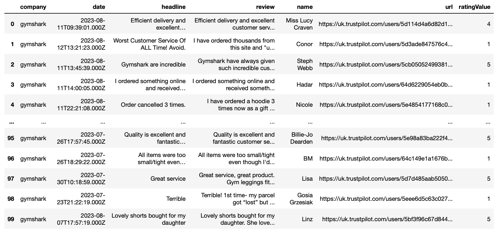

# TrustPilot Review Scraper

A Python class for scraping reviews from Trustpilot.

## Table of Contents

- [Introduction](#introduction)
- [Features](#features)
- [Getting Started](#getting-started)
  - [Installation](#installation)
  - [Usage](#usage)
- [Class Overview](#class-overview)
- [Use Cases](#use-cases)
- [Usage Guidelines](#usage-guidelines)


## Introduction

This repository provides a Python class, `TrustPilotScraper`, designed to scrape reviews from Trustpilot pages and transform them into a structured DataFrame. This tool is useful for anyone looking to gather and analyze reviews from Trustpilot in a convenient and organized manner.

## Features

- Scrape reviews from Trustpilot pages.
- Transform scraped data into a structured DataFrame.
- Extract various review attributes including review content, author, headline, ratings, and dates.
- Customizable by specifying the URL and number of pages to scrape.

## Getting Started

### Installation
1. Clone this repository:

   ```
   git clone https://github.com/kitsamho/trustpilot-scraper.git
   cd trustpilot-scraper
   ```
   

2. Install the required packages

    ```
    pip install -r requirements.txt
    ```


### Usage

1. Import the class
    ```
    from trustpilot_scraper import TrustPilotScraper
    ```

2. Initialise the scraper with a Trustpilot URL and the number of pages to scrape:
    ```
    scraper = TrustPilotScraper(url="your_trustpilot_url_here", num_pages=10)
    ```
   
3. Run the scraper and generate the DataFrame
    ```
   df = scraper.run()
    ```



## Class Overview

The TrustPilotScraper class provides the following methods:

- __init__(self, url, num_pages): Initialize the scraper with a Trustpilot URL and the number of pages to scrape.
- scrape_reviews(self): Scrape reviews from the Trustpilot URL for the specified number of pages.
- __scrape_trustpilot_data(self, url): Private method to scrape data from a given Trustpilot URL.
- __get_content_from_page_results(self, page_result, key): Private method to extract nested content from the scraped JSON data.
- __extract_nested_content(self, page_result): Private method to extract nested content from a list of scraped JSON data.
- get_dataframe_results(self, reviews, headlines, ratings, authors, dates): Generate a DataFrame from the scraped review data.
- transform_nested_dataframe_column(df, nested_col, new_cols): Transform a nested column in the DataFrame into separate columns.
- run(self): Run the TrustPilotScraper to scrape reviews and generate the DataFrame.

## Use Cases

- Natural Language Processing (NLP): Analyse customer sentiments, opinions, and trends to gain insights into customer satisfaction and concerns.
- Classification: Train machine learning models to classify reviews into categories such as positive, negative, or neutral sentiments.
- Topic Modeling: Uncover the main topics and themes discussed in customer reviews, allowing you to understand what customers are talking about the most.
- Customer Experience Enhancement: Use the data to identify areas of improvement based on customer feedback and drive better decision-making.
- Competitive Analysis: Compare your company's reviews to those of competitors to gain a competitive edge and improve your offerings.


## Usage Guidelines

When using the TrustPilot Review Scraper, please keep the following usage guidelines in mind:

### Fair Use and Volume of Requests

In order to prevent IP blocking and ensure the availability of TrustPilot's services for all users, it's important to keep the volume of requests generated by the scraper reasonably low. Excessive or aggressive scraping can overload their servers and lead to IP blocks. We recommend using the scraper responsibly and considerate of their terms of use.

### Research and Experimental Use

The data scraped from TrustPilot using this tool should be used solely for research and experimental purposes. It is not intended for commercial gain, marketing, or any other activity that violates TrustPilot's terms of service. Please respect the platform's rules and ethical considerations when using the scraped data.

### Disclaimer

This scraper is provided as an open-source tool for educational and research purposes. The authors of this tool are not responsible for any misuse or violation of TrustPilot's terms of use. Users are advised to use the scraper responsibly and within legal and ethical boundaries.
